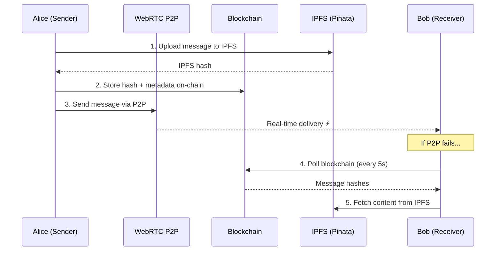

<div align="center">

# 🔗 Decentralized Chat App

**A peer-to-peer encrypted messaging platform built on Ethereum, IPFS, and WebRTC**

[](https://soliditylang.org/)
[](https://react.dev/)
[](https://fastapi.tiangolo.com/)
[](https://web3js.org/)
[](#license)

Deployed Link- https://decentralized-chat-app-one.vercel.app/

[Features](#-features) · [Architecture](#-architecture) · [Getting Started](#-getting-started) · [Smart Contract](#-smart-contract) · [Tech Stack](#-tech-stack) · [Guides](#-guides)

</div>

---

## ✨ Features

<details>
<summary><strong>🔐 Wallet-Based Authentication</strong></summary>

- **MetaMask Integration** — Connect your wallet with one click; auto-switches to Sepolia testnet
- **Manual Address Entry** — Fallback for users without MetaMask extension
- **No Passwords, No Accounts** — Your Ethereum wallet *is* your identity
- **Auto-Reconnect** — Restores session on page reload; detects MetaMask account changes

</details>

<details>
<summary><strong>💬 1-on-1 Encrypted Chat</strong></summary>

- **Dual Delivery** — Messages sent via WebRTC (instant P2P) *and* stored on blockchain + IPFS (permanent)
- **Auto-Fallback** — If P2P connection drops, seamlessly switches to blockchain polling every 5s
- **Connection Indicator** — 🟢 Green = P2P active | 🟠 Orange = blockchain sync mode
- **Message Persistence** — Chat history loaded from blockchain + IPFS on every page load
- **Quick Chat** — Start chatting with *any* wallet address without adding them as a friend first
- **Auto-Retry** — Up to 3 connection attempts with exponential backoff

</details>

<details>
<summary><strong>👥 Friends Management</strong></summary>

- **On-Chain Friends** — Add/remove friends directly on the Ethereum blockchain (gas required)
- **Local Friends** — Instantly add imported friends stored in localStorage (no gas)
- **Dual Storage** — Blockchain friends tagged `On-Chain`, imported friends tagged `Local`
- **Storage Stats** — Visual panel showing on-chain vs. local friend counts
- **Deduplication** — Blockchain + local friends merged and deduplicated by address

</details>

<details>
<summary><strong>👨‍👩‍👧‍👦 Group Chat</strong></summary>

- **Create Groups On-Chain** — Set name, description, and select members from your friends list
- **Group Messages** — Stored on blockchain + IPFS, same hybrid pattern as 1-on-1 chat
- **File Sharing** — Upload files via IPFS with inline image previews
- **Member Management** — Leave groups on-chain; admin voting system built into smart contract
- **Name Resolution** — Shows sender names from friends list or truncated addresses

</details>

<details>
<summary><strong>📹 Video & Audio Calls</strong></summary>

- **Video Calls** — Full video streaming with picture-in-picture local view
- **Audio Calls** — Audio-only mode with avatar display
- **Call Controls** — Mute/unmute mic, toggle camera, end call
- **Incoming Call Alerts** — Green banner with Accept/Decline buttons
- **Smart Fallback** — If video capture fails, automatically switches to audio-only
- **P2P Signaling** — Call setup negotiated through WebRTC data channel

</details>

<details>
<summary><strong>📁 File Transfer (Two Modes)</strong></summary>

| Mode | Max Size | Cost | Use Case |
|------|----------|------|----------|
| **WebRTC P2P** | 50 MB | Free | Direct transfer, real-time |
| **IPFS (Pinata)** | 10 MB | Free tier | Persistent, group sharing |

- **P2P Transfer** — Files chunked into 16KB pieces via WebRTC DataChannel, zero server involvement
- **IPFS Upload** — Files pinned to Pinata IPFS with gateway URLs for download
- **Inline Previews** — Images rendered directly in chat
- **Progress Tracking** — Real-time upload/download progress indicators
- **Broad Format Support** — Images, documents, audio, video, and archives

</details>

<details>
<summary><strong>🔒 Export / Import Chat History</strong></summary>

- **AES-256-GCM Encryption** — Chat backups encrypted with PBKDF2 key derivation (100K iterations)
- **Full Export** — Friends list + all messages (blockchain + IPFS) bundled into `.encrypted` file
- **Cross-Wallet Import** — Import another user's backup; auto-flips message perspective
- **Merge Logic** — Imported data merges with existing friends and messages
- **Password Protected** — Minimum 8 characters, 12+ recommended

</details>

<details>
<summary><strong>🌐 User Discovery</strong></summary>

- **Browse Registered Users** — See all users who have logged in
- **Search** — Filter friends by name or wallet address
- **Test Users** — One-click button to populate dummy users for development
- **Quick Add** — Add discovered users as friends directly

</details>

---

## 🏗 Architecture

```
┌─────────────────────────────────────────────────────────────────┐
│                        FRONTEND (React 19)                      │
│  ┌──────────┐ ┌──────────┐ ┌──────────┐ ┌──────────────────┐   │
│  │  Login   │ │  Home    │ │  Chat    │ │  Groups / Calls  │   │
│  └────┬─────┘ └────┬─────┘ └────┬─────┘ └────────┬─────────┘   │
│       │             │            │                 │             │
│  ┌────▼─────────────▼────────────▼─────────────────▼──────────┐ │
│  │                    Utility Layer                            │ │
│  │  blockchain.js · webrtc.js · ipfs.js · fileTransfer.js     │ │
│  │  friendsBlockchain.js · exportImport.js                    │ │
│  └──────┬──────────────┬──────────────┬───────────────────────┘ │
└─────────┼──────────────┼──────────────┼─────────────────────────┘
          │              │              │
    ┌─────▼─────┐  ┌─────▼─────┐  ┌────▼──────┐
    │ Ethereum  │  │  WebRTC   │  │   IPFS    │
    │ (Sepolia) │  │   P2P     │  │ (Pinata)  │
    │           │  │           │  │           │
    │ Solidity  │  │ simple-   │  │ pinJSON   │
    │ Contract  │  │ peer      │  │ pinFile   │
    └───────────┘  └─────┬─────┘  └───────────┘
                         │
                   ┌─────▼─────┐
                   │ Signaling │
                   │  Server   │
                   │ (FastAPI) │
                   └───────────┘
                  Only centralized
                     component
```

### Data Flow



---

## 🚀 Getting Started

### Prerequisites

| Tool | Version | Purpose |
|------|---------|---------|
| [Node.js](https://nodejs.org/) | 18+ | Frontend & Truffle |
| [Python](https://python.org/) | 3.9+ | Signaling server |
| [MetaMask](https://metamask.io/) | Latest | Wallet authentication |
| [Truffle](https://trufflesuite.com/) | 5.x | Smart contract deployment |

### 1️⃣ Clone & Install

```bash
# Clone the repository
git clone https://github.com/your-username/decentralized-chat-app.git
cd decentralized-chat-app

# Install frontend dependencies
cd frontend
npm install

# Install backend dependencies
cd ../backend
pip install -r requirements.txt
```

### 2️⃣ Deploy Smart Contract

```bash
cd backend

# Compile the contract
truffle compile

# Deploy to Sepolia testnet
truffle migrate --network sepolia --reset

# Copy ABI to frontend
cd ..
node copy-abi.js
```

### 3️⃣ Configure Environment

Create `frontend/.env`:

```env
# Contract (update after deployment)
REACT_APP_CONTRACT_ADDRESS=0xYourDeployedContractAddress
REACT_APP_NETWORK_ID=11155111

# Alchemy RPC
REACT_APP_RPC_URL=https://eth-sepolia.g.alchemy.com/v2/YOUR_ALCHEMY_KEY

# Pinata IPFS (optional — enables persistent file storage)
REACT_APP_PINATA_API_KEY=your_pinata_api_key
REACT_APP_PINATA_SECRET_KEY=your_pinata_secret_key

# Signaling Server
REACT_APP_SIGNALING_SERVER=http://localhost:8000
```

### 4️⃣ Start the App

```bash
# Terminal 1 — Start signaling server
cd backend
uvicorn app:app --reload

# Terminal 2 — Start React frontend
cd frontend
npm start
```

Open **http://localhost:3000** and connect with MetaMask!

---

## 📜 Smart Contract

The `ChatMetadata.sol` contract (Solidity 0.8.19) manages all on-chain data:

<details>
<summary><strong>Contract Functions</strong></summary>

| Category | Function | Description |
|----------|----------|-------------|
| **Messages** | `storeMetadata(receiver, hash, ipfsHash)` | Store message reference on-chain |
| | `getMessagesBetweenUsers(user1, user2)` | Retrieve all message IDs between two users |
| | `getMetadata(id)` | Get message details by ID |
| | `getMessageCount(user1, user2)` | Count messages between users |
| **Friends** | `addFriend(address, name)` | Add a friend on-chain |
| | `removeFriend(address)` | Remove a friend |
| | `getFriends(user)` | Get all friends of a user |
| | `getFriendCount(user)` | Count friends |
| **Groups** | `createGroup(name, desc, members[])` | Create a group on-chain |
| | `sendGroupMessage(groupId, hash, ipfsHash)` | Send message to group |
| | `getGroupMessages(groupId)` | Retrieve group messages |
| | `leaveGroup(groupId)` | Leave a group |
| | `voteForAdmin(groupId, admin)` | Vote for group admin |

</details>

<details>
<summary><strong>Events Emitted</strong></summary>

```solidity
event MetadataStored(uint256 id, address sender, address receiver, string hash, string ipfsHash)
event FriendAdded(address indexed user, address indexed friend, string name)
event FriendRemoved(address indexed user, address indexed friend)
event GroupCreated(uint256 groupId, string name, address creator)
event MemberAdded(uint256 groupId, address member)
event MemberRemoved(uint256 groupId, address member)
event GroupMessageSent(uint256 id, uint256 groupId, address sender, string hash, string ipfsHash)
event AdminVoteCast(uint256 groupId, address voter, address admin)
```

</details>

---

## 🛠 Tech Stack

<table>
<tr>
<td>

### Frontend
- ⚛️ React 19
- 🎨 Material-UI (MUI) 7
- 🔀 React Router 7
- 📅 date-fns

</td>
<td>

### Blockchain
- 🔗 Web3.js 4.16
- 📝 Solidity 0.8.19
- 🍫 Truffle Suite
- 🦊 MetaMask
- 🧪 Sepolia Testnet

</td>
<td>

### P2P & Storage
- 📡 simple-peer (WebRTC)
- 📌 Pinata (IPFS)
- 🔊 STUN/TURN servers
- 💾 localStorage

</td>
</tr>
<tr>
<td>

### Backend
- 🐍 FastAPI
- ⚡ Uvicorn
- 🔌 WebSocket

</td>
<td>

### Security
- 🔐 AES-256-GCM
- 🗝️ PBKDF2 (100K iter)
- #️⃣ SHA-256 hashing
- 🌐 Web Crypto API

</td>
<td>

### Tooling
- 📦 npm / pip
- 🔧 config-overrides
- 🧩 buffer/stream polyfills

</td>
</tr>
</table>

---

## 🗺 Page Routes

| Route | Page | Description |
|-------|------|-------------|
| `/` | Login | MetaMask connect or manual wallet entry |
| `/home` | Home | Friends sidebar + quick chat + user discovery |
| `/friends` | Friends | Manage friends, export/import data |
| `/chat/:address` | Chat | 1-on-1 messaging with a specific user |
| `/groups` | Groups | View and create groups |
| `/group-chat/:id` | Group Chat | Group messaging with file sharing |
| `/calls` | Calls | Video and audio calls |

---

## 📚 Guides

| Guide | Description |
|-------|-------------|
| [VIDEO_CALL_GUIDE.md](VIDEO_CALL_GUIDE.md) | Setting up and using video/audio calls |
| [IPFS_DEPLOYMENT_GUIDE.md](IPFS_DEPLOYMENT_GUIDE.md) | Deploying to IPFS for fully decentralized hosting |
| [EXPORT_IMPORT_GUIDE.md](EXPORT_IMPORT_GUIDE.md) | Encrypting, exporting, and importing chat history |

---

## 🔒 Security Highlights

- **No server-stored messages** — Content flows P2P or through decentralized networks
- **Wallet-based identity** — No email, no password, no central user database
- **AES-256-GCM encryption** — Chat exports protected with military-grade encryption
- **Dynamic gas pricing** — Fetches network gas price with multiplier for reliable transactions
- **Minimal server role** — Backend only relays WebRTC signaling metadata, never message content

---

## 🤝 Contributing

1. Fork the repository
2. Create your feature branch (`git checkout -b feature/amazing-feature`)
3. Commit your changes (`git commit -m 'Add amazing feature'`)
4. Push to the branch (`git push origin feature/amazing-feature`)
5. Open a Pull Request

---

## 📄 License

This project is licensed under the MIT License — see the [LICENSE](LICENSE) file for details.

---

<div align="center">

**Built with ❤️ on Ethereum**

*Your messages. Your keys. Your data.*

</div>
